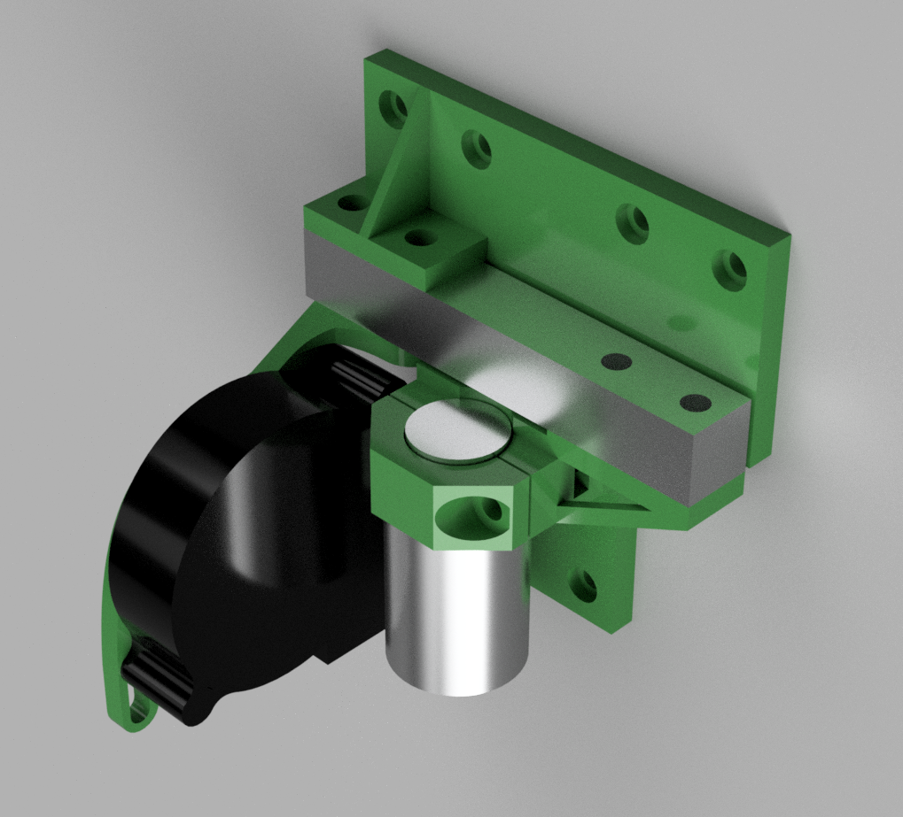

# Anet A8 LoadCell BedLeveling

## Why?
No Z Sensor offset, just probe with the tip of your nozzle.

## how it's looks



## Limitation

### HX711
In default, the hx711 is set to send only 10 sps, to upgrade to 80 sps, depends on your module, you need to change an jumper replace an 0 Ohm resistor.

### leveling
HX711 has only a sample rate of 80 sps and need some communication time, related to this, my bed probing runs with an Z speed of only 1ms/s

```gcode
G28 XY; home XY axes
G28 Z; home Z FAST
M203 Z1.00 ;slow speed for z for homing and leveling (slow probe)
G28 Z; home Z SLOW
G29 P2
M203 Z8.00 ; reset Z Speed limit
```

## Good to Know
### 3d model
The 3D model is maybe not the best one yet, the sledge is depends on the LoadCell now wider than usual, this means you need also tweak a little bit your marlin settings for offset of X,Y.

I can't provide my ones, related I have some other tweak from the stock Anet A8 behavior.

### arduino source code
In the sourcecode I have currently set static to trigger at an LoadCell Value over 20, if your setup variates, you need maybe tweak this line
```
  if (i<-20) {
```

### trigger
In the source code, I also set the onboard LED, so you can check visual if your LoadCell reach the force.

## what you need

1. LoadCell (I have just take a 5kg one) (~2€)
1. HX711 LoadCell Amplifier (sometimes already in the Loadcell included)
1. Arduino (i have take just an arduino nano clone ~4€)
1. printed 3d models from the (./models) directory (~2€)
1. some wires

**cost: around 8€**

## How to wire

```
ANet Z Input (5V)     <--> arduino VCC
ANet Z Input (GND)    <--> arduino GND
ANet Z Input (SIGNAL) <--> arduino PIN 4
```

```
HX711 (GND) <--> arduino GNX
HX711 (VCC) <--> arduino VCC
HX711 (DT)  <--> arduino PIN 3
HX711 (SCK) <--> arduino PIN 2
```
